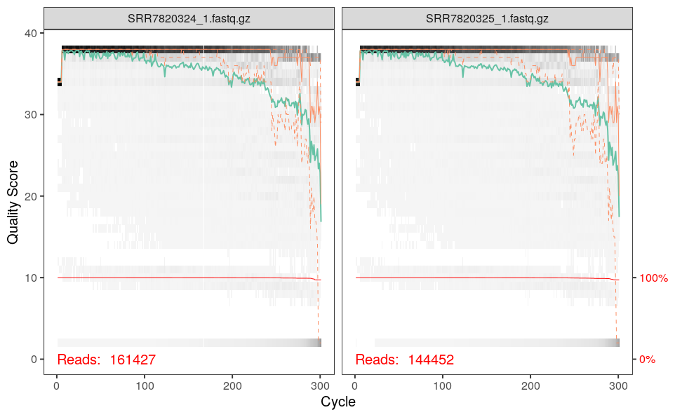
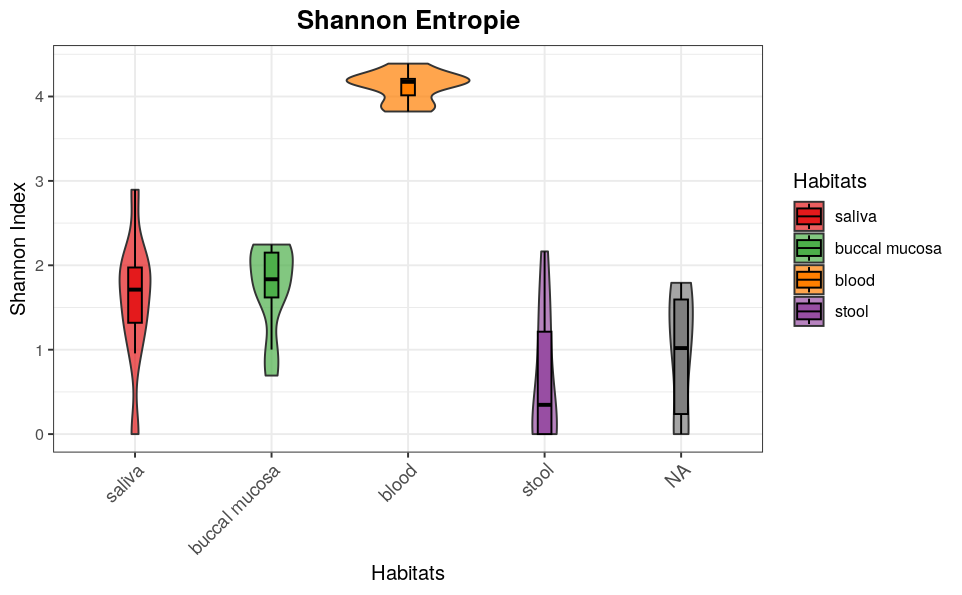
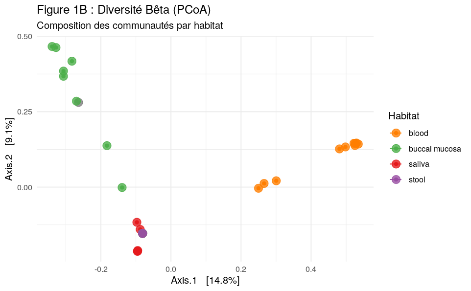

# CC2_Itiare_MATEHAU

---
title: "Analyse_(Oh et al., 2023)"
output:
  pdf_document: default
  html_document: default
date: "2026-01-12"
---
#INTRODUCTION

Cette étude, intitulée "Metagenomic characterization of the microbiomes in five different body habitats of otherwise healthy individuals with periodontal disease", a été publiée le 13 septembre 2023 dans la revue Frontiers in Cellular and Infection Microbiology. Les auteurs principaux sont Sujin Oh, Hyo-Jung Lee et Kyoung Un Park, issus de l'Université Nationale de Séoul.
Il porte sur la caractérisation des profils microbiens (taxonomiques et fonctionnels )dans cinq habitats corporels différents chez des individus atteints de maladie parodontale mais par ailleurs en bonne santé. Cette recherche vise à étudier le microbiome buccal, du sang et du tube digestif et à comprendre comment leur altération peut contribuer à des maladies parodontale comme des maladie cardio-vasculaire, l’Alzheimer et du cancer, avant même l’apparition des premiers symptômes cliniques.
Dans l’analyse effectuée avec le pipeline DADA2, l’objectif est de comparer la structure et la signature taxonomique des microbiomes systémiques.


#MATERIELS ET METHODES

L'étude porte sur un échantillon de 10 adultes présentant une maladie parodontale. Des prélèvements ont été effectués dans cinq sites distincts, au niveau du sang, de la muqueuse buccale, de la plaque dentaire, de la salive ainsi que des selles. La méthode principale repose sur le séquençage du gène ARNr 16S via la plateforme MiSeq. L'analyse bioinformatique a utilisé QIIME2 pour la diversité et ANCOM-BC pour l'abondance différentielle.

##DADA2

Pour analyser les données brutes de séquençage de cet article, les auteurs utilisé  le pipeline DADA2. Contrairement aux méthodes traditionnelles basées sur les OTU (Unités Taxonomiques Opérationnelles), DADA2 permet de modéliser les erreurs de séquençage pour corriger les lectures et produire des ASV (Amplicons Sequence Variants). Le processus inclut le filtrage de qualité, la déduplication, la fusion des lectures "paired-end" et la suppression des chimères.


##1-PREPARATION
###1-a) Il faut installer le package DADA2 afin de travailler sur les données de l'article:
```{r}
library(dada2); packageVersion("dada2")
```
[1] ‘1.28.0’

```{r}
# Définir le chemin vers le dossier contenant les fichiers FASTQ après décompression.
path <- "~/Article_ADM" 

# Liste tous les fichiers présents dans ce dossier pour vérifier que les FASTQ sont présent.
list.files(path)
```
[1] "ena-file-download-read_run-PRJNA489752-fastq_ftp-20260112-1450.sh"
[2] "SraRunTable.csv" 

###1-b)Télécharement des métadonnées.
```{r}
library(readr)
metadata<- read_csv("~/Article_ADM/SraRunTable.csv")
```

###1-c)Assignation du chemin, la commande list.files(path) permet de créer un vecteur contenant les noms des fichiers fastq.
```{r}
path <- "~/Article_ADM"
fnFs <- sort(list.files(path, pattern="_1.fastq", full.names = TRUE))

# Récupérer et trier tous les fichiers FASTQ reverse.
fnRs <- sort(list.files(path, pattern="_2.fastq", full.names = TRUE))

# Extraire les noms d'échantillons à partir des fichiers forward.
# Suppose que les fichiers ont le format SAMPLENAME_XXX.fastq.
sample.names <- sapply(strsplit(basename(fnFs), "_"), `[`, 1)
```

##2-Inspecter les profils de qualité de lecture
```{r}
plotQualityProfile(fnFs[1:2])
```


Les profils Forward révèlent un séquençage de haute qualité (Q>30) , malgré une baisse  de la précision en fin de lecture au-delà de 230 pb, ce qui représente une baisse de la qualité au delà 260pb.

```{r}
plotQualityProfile(fnRs[1:2])
```
.png) 

La figure ci-dessus indique que les reads "reverse" sont de moins bonne qualité en moyenne que les reads "forward". Les profils Reverse révèlent, tout comme les profils Forward, un séquençage de haute qualité (Q>30) , malgré une baisse  de la précision aussi en fin de lecture au-delà de 230 pb.

##3-FILTRER ET DECOUPER
```{r}
# Définir le chemin et le nom des fichiers forward filtrés
# Les fichiers filtrés seront placés dans le sous-dossier "filtered" avec le suffixe "_F_filt.fastq.gz".
filtFs <- file.path(path, "filtered", paste0(sample.names, "_F_filt.fastq.gz"))

# Définir le chemin et le nom des fichiers reverse filtrés
# Les fichiers filtrés seront placés dans le sous-dossier "filtered" avec le suffixe "_R_filt.fastq.gz".
filtRs <- file.path(path, "filtered", paste0(sample.names, "_R_filt.fastq.gz"))

# Associer les noms des échantillons aux vecteurs de fichiers filtrés pour un accès plus facile.
names(filtFs) <- sample.names
names(filtRs) <- sample.names
```

```{r}
# Filtrer et tronquer les fichiers FASTQ forward et reverse selon la qualité et la longueur, supprimer les lectures contenant des N ou trop d'erreurs, retirer les contaminants PhiX, compresser les fichiers filtrés, utilise le multithreading, et stocker un tableau résumant le nombre de lectures conservées et supprimées.
out <- filterAndTrim(fnFs, filtFs, fnRs, filtRs, truncLen=c(240,160),
                     maxN=0, maxEE=c(2,2), truncQ=2, rm.phix=TRUE,
                     compress=TRUE, multithread=FALSE)  

head(out)  # Affiche un aperçu du tableau des lectures conservées
```
reads.in reads.out
SRR7820324_1.fastq.gz   161427    138580
SRR7820325_1.fastq.gz   144452    122765
SRR7820326_1.fastq.gz   167665    145579
SRR7820327_1.fastq.gz   171871    146349
SRR7820328_1.fastq.gz   167836    145566
SRR7820329_1.fastq.gz   174471    152123

##4-APPRENTISSAGE DU TAUX D'ERREUR
```{r}
# Cette commande apprend les profils d'erreurs à partir des fichiers forward filtrés pour modéliser la probabilité d'erreurs de séquençage, en utilisant le multithreading pour accélérer le calcul.
errF <- learnErrors(filtFs, multithread=FALSE)
```
132785520 total bases in 553273 reads from 4 samples will be used for learning the error rates.

```{r}
# Cette commande apprend les profils d'erreurs à partir des fichiers reverse filtrés pour modéliser la probabilité d'erreurs de séquençage, en utilisant le multithreading pour accélérer le calcul.
errR <- learnErrors(filtRs, multithread=FALSE)
```
111814240 total bases in 698839 reads from 5 samples will be used for learning the error rates.

```{r}
# Affiche le graphique des profils d’erreurs appris pour les lectures forward afin de comparer les taux d’erreur observés et théoriques selon les scores de qualité.
plotErrors(errF, nominalQ=TRUE)
```
.png)

##5-INTERFERENCE DES ECHANTILLIONS
```{r}
# Appliquer l’algorithme DADA aux fichiers forward filtrés pour inférer les séquences exactes d’amplicons en corrigeant les erreurs de séquençage à partir du modèle d’erreurs appris.
dadaFs <- dada(filtFs, err=errF, multithread=TRUE)
```

```{r}
# Cette commande affiche le résultat de l’inférence DADA pour le premier échantillon afin d’examiner les séquences identifiées et leur abondance.
dadaFs[[1]]
```
dada-class: object describing DADA2 denoising results
557 sequence variants were inferred from 32734 input unique sequences.
Key parameters: OMEGA_A = 1e-40, OMEGA_C = 1e-40, BAND_SIZE = 16

```{r}
# Appliquer l’algorithme DADA aux fichiers reverse filtrés pour inférer les séquences exactes d’amplicons en corrigeant les erreurs de séquençage à partir du modèle d’erreurs appris.
dadaRs <- dada(filtRs, err=errR, multithread=TRUE)
```

##6-FUSION DES LECTURES APPROPRIEES
```{r}
# Fusionner les lectures forward et reverse pour chaque échantillon en alignant les régions qui se chevauchent et en éliminant les paires incohérentes.
mergers <- mergePairs(dadaFs, filtFs, dadaRs, filtRs, verbose=TRUE)
```
```{r}
# Cette commande affiche les premières lignes du tableau de fusion du premier échantillon pour vérifier le bon appariement des lectures.
head(mergers[[1]])
```

##7-CONSTRUCTION DE LA TABLE DE SEQUENCES
```{r}
# Construire la table de séquences (Sequence Table) à partir des lectures fusionnées, où chaque ligne correspond à un échantillon et chaque colonne à une séquence unique.
seqtab <- makeSequenceTable(mergers)

# Cette commande affiche les dimensions de la table (nombre d’échantillons et nombre de séquences uniques détectées).
dim(seqtab)
```
[1]   50 1215

```{r}
# Cette commande affiche la distribution des longueurs des séquences inférées pour vérifier leur homogénéité et détecter d’éventuelles séquences aberrantes.
table(nchar(getSequences(seqtab)))
```
240 248 249 252 253 255 256 258 259 260 262 263 264 265 266 268 269 272 273 274 275 276 
  1   1   3   1   2   6   1   1   1   1   3   2   1   6   2   1   1   1   1  11  12   1 
277 279 283 284 285 286 287 289 290 291 293 294 295 296 297 298 302 303 304 305 306 311 
  1   1   2   4  17  63   5 108  18  12   3   5   7  10   9  14   2   2   1   7  50   2 
312 313 315 316 317 319 320 321 322 323 324 325 326 328 329 333 334 336 337 339 340 341 
  3   1   1   2   5   1   3   1   1   2   3   4   2   6   8   2   2   4   3   1   3   2 
342 343 345 346 347 348 350 351 352 353 354 355 356 357 358 359 360 361 362 363 364 365 
  4   1   3   9   4   1   5   1   4   1   5   5   7   2   8  32   3   8  10   7   4   7 
366 367 368 369 370 371 372 373 374 375 376 377 378 379 380 381 382 383 384 385 386 387 
 17   4  29   6  12   4   6  40   6 105  22   9  33  20  40   7  99  29  22  33  20  47 
388 
 11

##8-Suspenssion des chimères
```{r}
# Supprimer les séquences chimériques de la table à l’aide de la méthode de détection par consensus, en utilisant le multithreading pour accélérer le traitement.
seqtab.nochim <- removeBimeraDenovo(seqtab, method="consensus", multithread=TRUE, verbose=TRUE)
```
Identified 521 bimeras out of 1215 input sequences.

```{r}
# Cette commande affiche les dimensions de la table après suppression des séquences chimériques pour connaître le nombre de séquences restantes.
dim(seqtab.nochim)
```
[1]  50 694

##9-SUIVI DU PIPELINE
```{r}
# Calcule la proportion de séquences non chimériques par rapport au total pour évaluer la qualité du jeu de données après détection des chimères
sum(seqtab.nochim)/sum(seqtab)
```
[1] 0.6708379

```{r}
# Crée un tableau de suivi récapitulant le nombre de lectures conservées à chaque étape du pipeline DADA2 (filtrage, débruitage, fusion et suppression des chimères) pour chaque échantillon
getN <- function(x) sum(getUniques(x))
track <- cbind(out, sapply(dadaFs, getN), sapply(dadaRs, getN), sapply(mergers, getN), rowSums(seqtab.nochim))
# If processing a single sample, remove the sapply calls: e.g. replace sapply(dadaFs, getN) with getN(dadaFs)
colnames(track) <- c("input", "filtered", "denoisedF", "denoisedR", "merged", "nonchim")
rownames(track) <- sample.names
head(track)
```
  input filtered denoisedF denoisedR merged nonchim
SRR7820324 161427   138580    136888    137779     14      14
SRR7820325 144452   122765    119828    120995      0       0
SRR7820326 167665   145579    142329    143788     20      19
SRR7820327 171871   146349    144955    145548     15      14
SRR7820328 167836   145566    142073    144041      9       7
SRR7820329 174471   152123    148933    150382     15      11

##10-ATTRIBUER UNE TAXONOMIE
```{r}
# Assigne la taxonomie à chaque séquence non chimérique en utilisant la base SILVA v138, avec multithreading pour accélérer le traitement
taxa <- assignTaxonomy(seqtab.nochim, "silva_nr99_v138.2_toGenus_trainsetw.fa.gz", multithread=FALSE)
```
```{r}
# Prépare un tableau de taxonomie pour affichage en supprimant les noms de séquences afin de faciliter la lecture
taxa.print <- taxa # Removing sequence rownames for display only
rownames(taxa.print) <- NULL
head(taxa.print)
```
Kingdom     Phylum Class Order Family Genus
[1,] "Eukaryota" NA     NA    NA    NA     NA   
[2,] "Eukaryota" NA     NA    NA    NA     NA   
[3,] "Eukaryota" NA     NA    NA    NA     NA   
[4,] "Eukaryota" NA     NA    NA    NA     NA   
[5,] "Eukaryota" NA     NA    NA    NA     NA   
[6,] "Eukaryota" NA     NA    NA    NA     NA 

#RESULTATS
##Handoff to phyloseq

```{r}
library(phyloseq); packageVersion("phyloseq")
```
[1] ‘1.44.0’

```{r}
library(Biostrings); packageVersion("Biostrings")
```
[1] ‘3.4.3’

```{r}
library(ggpubr)
```

```{r}
theme_set(theme_bw())
```

```{r}

ps <- phyloseq(
  otu_table(seqtab.nochim, taxa_are_rows=FALSE), 
  sample_names(metadata),                         
  tax_table(taxa)                                
)
```

```{r}
ps
```
phyloseq-class experiment-level object
otu_table()   OTU Table:         [ 694 taxa and 50 samples ]
tax_table()   Taxonomy Table:    [ 694 taxa by 6 taxonomic ranks ]

```{r}
rownames(metadata) <- metadata$Run
metadata$Habitat <- metadata$isolation_source
sample_data(ps) <- sample_data(metadata)
```

```{r}


alpha_meas <- estimate_richness(ps, measures="Shannon")
sample_data(ps)$Shannon <- alpha_meas$Shannon


sample_data(ps)$Habitat <- factor(sample_data(ps)$isolation_source, 
    levels = c("saliva", "subgingival plaque", "buccal mucosa", "blood", "stool"))


couleurs_habitat <- c(
  "saliva" = "#E41A1C", 
  "subgingival plaque" = "#377EB8", 
  "buccal mucosa" = "#4DAF4A", 
  "blood" = "#FF7F00", 
  "stool" = "#984EA3"
)


ggplot(as(sample_data(ps), "data.frame"), aes(x=Habitats, y=Shannon, fill=Habitats)) +
  geom_violin(alpha=0.7) + 
  geom_boxplot(width=0.1, color="black", outlier.shape = NA) +
  scale_fill_manual(values=couleurs_habitat) +
  theme_bw() +
  labs(
    title = "Shannon Entropie", 
    y = "Shannon Index", 
    x = "Habitats"
  ) +
  theme(
    plot.title = element_text(hjust = 0.5, face = "bold", size = 14),
    axis.text.x = element_text(angle = 45, hjust = 1, size = 10), # Évite la superposition
    legend.position = "right"
  )
```


```{r}
ggplot(as(sample_data(ps), "data.frame"), aes(x=Habitats, y=Observed, fill=Habitats)) +
  geom_violin(alpha=0.7) + 
  geom_boxplot(width=0.1, outlier.shape = NA) +
  scale_fill_manual(values=couleurs_habitat) +
  labs(title="Caractéristiques Observées", y="Observed Features", x="Habitats") + 
  mon_theme
```
.png)

L'analyse de la diversité alpha, mesurée par l'indice de Shannon et les caractéristiques observées, révèle que le microbiome sanguin présente les niveaux de richesse et d'équitabilité les plus élevés parmi les cinq habitats étudiés, avec des valeurs comprises entre 8 et 9. Cette diversité supérieure est statistiquement significative par rapport aux autres sites tel que les selles et la muqueuses qui affichent une diversité moindre.Ces résultats démontrent que le sang, chez les patients présentant une maladie parodontale, héberge une communauté bactérienne plus diversifiée que les niches écologiques comme l'intestin.


```{r}

ps_clean <- prune_samples(sample_sums(ps) > 0, ps)
ps_rel <- transform_sample_counts(ps_clean, function(x) x / sum(x))
iDist <- phyloseq::distance(ps_rel, method="bray")
iPCoA <- ordinate(ps_rel, "PCoA", distance=iDist)

couleurs_habitat <- c(
  "saliva" = "#E41A1C", 
  "subgingival plaque" = "#377EB8", 
  "buccal mucosa" = "#4DAF4A", 
  "stool" = "#984EA3", 
  "blood" = "#FF7F00"
)

plot_ordination(ps_rel, iPCoA, color="isolation_source") +
  geom_point(size=4, alpha=0.8) +
  stat_ellipse(aes(color=isolation_source), linetype = 2) + 
  scale_color_manual(values=couleurs_habitat) +
  theme_minimal() +
  labs(title="Figure 1B : Diversité Bêta (PCoA)",
       subtitle="Composition des communautés par habitat",
       color="Habitat")
```


L'analyse de la bêta-diversité par l'indice de Bray-Curtis révèle deux regroupements distincts : le microbiome du sang forme un groupe isolé, témoignant de compositions bactériennes uniques et spécialisées. À l'inverse, les échantillons de la bouche se regroupent, indiquant une forte similitude écologique au sein de la cavité buccale. Cette séparation claire sans chevauchement majeur entre le sang et la bouche confirme que chaque niche biologique héberge une communauté microbienne spécifique.


```{r}
ps_non_empty <- prune_samples(sample_sums(ps) > 0, ps)
ps_phylum <- tax_glom(ps_non_empty, "Phylum")
ps_rel <- transform_sample_counts(ps_phylum, function(x) 100 * x / sum(x))


df <- psmelt(ps_rel)
df <- df %>%
  mutate(Habitat = tolower(as.character(isolation_source))) %>%
  mutate(Habitat = case_when(
    grepl("plaque", Habitat) ~ "plaque",
    grepl("mucosa", Habitat) ~ "buccal mucosa",
    TRUE ~ Habitat
  ))


df_plot <- df %>%
  mutate(Phylum = as.character(Phylum)) %>%
  mutate(Phylum = ifelse(is.na(Phylum) | Phylum == "" | Phylum == "unclassified", 
                         "Unclassified Bacteria", Phylum)) %>%
  group_by(Habitat, Phylum) %>%
  summarise(Abundance = mean(Abundance), .groups = 'drop') %>%
 
  mutate(Phylum = ifelse(Abundance < 1, "< 1%", Phylum))


couleurs_phyla <- c(
  "Actinomycetota" = "#D53E4F", "Bacteroidota" = "#3288BD",
  "Cyanobacteria" = "#66C2A5", "Campylobacterota" = "#9E0142",
  "Bacillota" = "#F46D43", "Fusobacteriota" = "#FEE08B",
  "Patescibacteria" = "#946739", "Pseudomonadota" = "#ABDDA4",
  "Spirochaetota" = "#E6F598", "Unclassified Bacteria" = "#BCBDDC",
  "< 1%" = "#7F7F7F"
)


ggplot(df_plot, aes(x = Habitat, y = Abundance, fill = Phylum)) +
  geom_bar(stat = "identity", position = "stack", width = 0.75) +
  scale_y_continuous(expand = c(0,0), limits = c(0, 100.1)) + 
  scale_fill_manual(values = couleurs_phyla) +
  theme_bw() +
  labs(x = "Habitats", y = "Relative abundance (%)", title = "Figure 3 : Phylum-level composition") +
  theme(
    axis.text.x = element_text(angle = 45, hjust = 1, face = "bold", size = 10),
    panel.grid = element_blank(),
    legend.position = "right"
  )
```
.png)

Le microbiome sanguin, de la muqueuse et de la salive sont dominées par les Pseudomonadota . À l'opposé, les selles présentent une composition très spécialisée, massivement dominée par les Bacteroidota et les Bacillota (Firmicutes). L’habitat de la plaque dentaire conserve une identité propre avec une présence marquée de Bacteroidota. 

#DISCUSSION

En comparant l’analyses (issues de DADA2 et Phyloseq) avec les données de l'article, l’observation d’une dynamique intéressante entre la réalité biologique et les choix méthodologiques. L'article met en avant le microbiome sanguin comme étant le plus diversifié, l’indice de Shannon obtenu semble appuyer la même conclusion. Cependant, les valeurs absolues sont légèrement plus basses. Cependant, l'absence de données pour la plaque dentaire (notée NA) pourraient provenir de paramètres de filtrage trop sévères.Lors de l'étape de raréfaction dans Phyloseq ces échantillons n'ont probablement pas atteint le seuil minimum de lecture requis et ont été automatiquement écartés. 
Sur le plan de la bêta-diversité, malgré l'absence de la plaque, nos résultats confirment la séparation nette observée dans l'article. Le sang, les selles et les tissus buccaux ne se mélangent pas ; ils forment des îles microbiennes distinctes. Cela prouve que chaque zone du corps impose ses propres règles environnementales aux bactéries qui s'y installent.
Enfin, l’analyse taxonomique est très cohérente avec l'étude de référence. Cela confirme que les Pseudomonadota sont les piliers du microbiome sanguin et de la muqueuse, tandis que les Bacteroidota et les Bacillota (Firmicutes) règnent sur les selles. Cette stabilité dans les résultats, malgré des pipelines différents, renforce l'idée que ces phyla sont les véritables signatures biologiques de nos habitats corporels. 

#CONCLUSION

Cette étude a permis de confronter les profils microbiens de cinq habitats corporels chez des patients atteints de maladie parodontale. Le corps humain ne constitue pas un environnement uniforme, mais un archipel de niches écologiques hautement spécialisées.
En définitive, ce travail renforce l'idée que le microbiome systémique est un indicateur précieux de l'état de santé.
